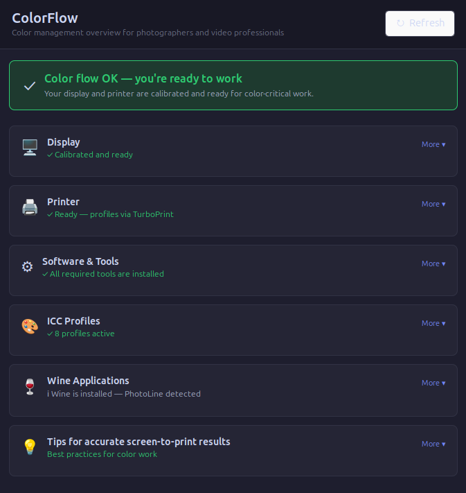

# ColorFlow

**Color management dashboard for photographers and video professionals on Linux.**



ColorFlow gives you a clear, human-friendly overview of your color management setup — so you can focus on your work instead of troubleshooting why your prints don't match your screen.

---

## Background

I'm Peter, a hobby photographer who shoots on film and scans the negatives. Getting consistent colors from scan to screen to print on Linux turned out to be more complicated than it needed to be — scattered tools, cryptic error messages, and no single place to check whether everything was actually working.

ColorFlow started as a personal tool to make sense of my own setup. I hope it can save other photographers and video professionals on Linux the same hours of troubleshooting I went through.

This project was built together with [Claude](https://claude.ai) (Anthropic's AI assistant). Testing, feedback, and contributions are very welcome.

---

## ☕ Support this project

If ColorFlow saves you time or helps you understand your color workflow, you can support its development:

<a href="https://www.buymeacoffee.com/Kalifornia1979" target="_blank">
  
</a>

Even a small contribution helps me continue improving the tool.

ColorFlow is built for photographers and video professionals who:

- Work on Linux (Ubuntu, Fedora, or similar with GNOME)
- Use a calibrated display and a color-managed printer
- Want to know at a glance whether their color workflow is set up correctly
- May use Windows applications like PhotoLine via Wine

---

## What does it do?

ColorFlow checks your system and presents the results as simple cards — green means ready, yellow means something needs attention. Each card has a **More** button with a plain-language explanation and, where relevant, a concrete action to take.

**Display** — checks whether your ICC profile is loaded and your display is calibrated. Detects displays with internal hardware LUTs (such as Eizo ColorEdge) and explains when external LUT loading is not needed.

**Printer** — checks whether your printer is registered and has ICC profiles available. Detects TurboPrint, CUPS, and colord-managed printers.

**Software & Tools** — verifies that the necessary color management tools are installed (colormgr, dispwin, xcalib). Provides a copy-ready install command if anything is missing.

**ICC Profiles** — lists your active color profiles with readable names, separated from system profiles. Detects and names TurboPrint profiles automatically.

**Wine Applications** — detects image editing applications running inside Wine (PhotoLine, Photoshop, Lightroom, Capture One, GIMP). Explains the double color correction problem and how to avoid it. Detects printer profiles inside Wine and clarifies what needs attention and what does not.

**Tips** — practical best practices for accurate screen-to-print results.

---

## Requirements

- Linux with GNOME (tested on Ubuntu 24.04 LTS)
- Python 3.8 or later
- GTK 3 Python bindings: `python3-gi`
- colord: `colormgr`
- Argyll CMS (for dispwin): `argyll`

Install requirements on Ubuntu/Debian:

```bash
sudo apt install python3-gi gir1.2-gtk-3.0 argyll
```

---

## Installation

Clone the repository and run the installer:

```bash
git clone https://github.com/Kalifornia1979/colorflow.git
cd colorflow
bash install.sh
```

The installer will:
- Copy `colorflow.py` to `~/.local/bin/`
- Copy the icon to `~/.local/share/icons/`
- Create a desktop entry so ColorFlow appears in your applications menu

After installation, find ColorFlow in your applications menu or run it directly:

```bash
python3 ~/.local/bin/colorflow.py
```

---

## Uninstall

```bash
rm ~/.local/bin/colorflow.py
rm ~/.local/share/icons/colorflow.svg
rm ~/.local/share/applications/colorflow.desktop
```

---

## Known limitations

- Wine application detection covers common image editors. Other Wine applications with color management may not be detected automatically.
- Display hardware LUT detection covers Eizo ColorEdge CS/CG and NEC MultiSync PA series. Other professional displays with internal LUTs may show a generic LUT warning.
- TurboPrint printer profiles are detected via colord. Profiles managed entirely outside colord may not appear.

---

## Roadmap

- PrintFlow: a companion tool focused on printer workflow and paper profile management
- Wayland support improvements
- Broader display hardware LUT database
- Support for additional Wine application paths

---

## Contact

- **GitHub Issues** — for bug reports, feature requests, and questions: [open an issue](../../issues)
- **Email** — pkr1979@pm.me

---

## License

MIT License — free to use, modify, and share.

---

## Credits

Built by Peter Risholm with [Claude](https://claude.ai) (Anthropic). Color management via [colord](https://www.freedesktop.org/software/colord/) and [Argyll CMS](https://www.argyllcms.com/).
